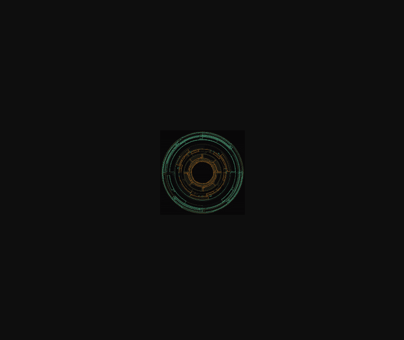

# Hideki Tsukamoto's Cypher

Cypher 是 Hideki Tsukamoto 的一个生成艺术项目，由以太坊虚拟机通过智能合约计算和绘制的 1024 个代币组成。Cypher 是“Apex”系列的一部分。

Hideki Tsukamoto 的一个完全链上的生成艺术项目——“Apex”系列中四个 NFT 系列中的第一个。

[Cypher 的生成于 2021 年 8 月 15 日通过以太坊网络拍卖进行。该系列现在由1024个具有不同视觉属性和特征的[独特 NFT组成。以下是项目概念的分解、一些简单的技术细节以及使每个 Cypher 独一无二的属性的解释。

