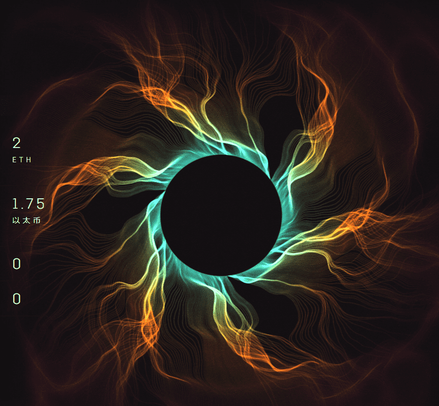

# [HT] FUSION

Hideki Tsukamoto 的 Origins 系列始于 2021 年 1 月 1 日的 SINGULARITY - 受到极端规模的创造和破坏的启发，组成 Origins 系列的系列使用简单的算法来生成爆炸性、混乱和复杂的艺术品，由收藏家当时生成和铸造的购买。

SINGULARITY 以大混沌和湍流黑洞的形式描绘了结局，而 FUSION 的算法旨在描绘与燃烧和创造开始相关的更小、更微观、类似粒子的事件。它与 SINGULARITY 有一些共同点，因为它是混乱的、对称的和复杂的，但完全不同的是，它的灵感来自粒子和化学燃烧以及地下摄影，而不是宇宙事件

