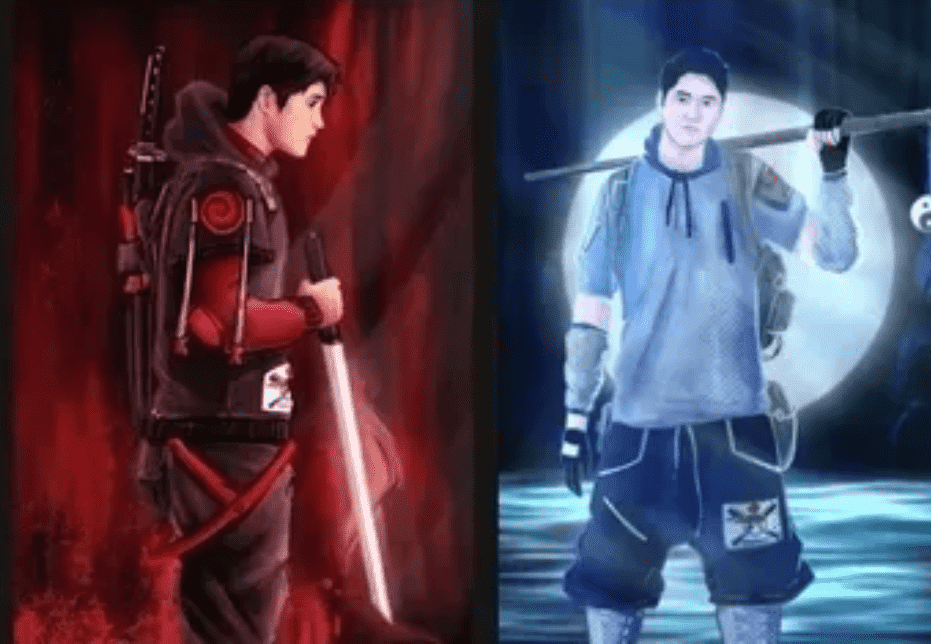

# theohtanis snapshot nft

Ohtanis 集合将包含 10000 个 NFT。1000 个 Fire Red Sun 代币 PNFT 有形资产支持的 NFT。有限的 1000 名持有者将获得 (1) 分级 Shohei Ohtani Rookie 1st year Sports Card。The 1000 Asset Backed NFT HOLDER 将获得实物资产赎回 Token。

奥塔尼斯系列Theohtanis NFT Collection 是通过动画艺术家代表大谷翔平 AKA（にとうりゅう，字面意思是“双剑风格”，Nitoryu/Nitōryū）的动画艺术家在现实中模仿难以想象的人才的史诗表达。1950 年代中期，动漫诞生于日本，并已发展成为一种全球史诗般的收藏艺术形式。Theohtanis 汇集了几个世纪以来的两种文化传统，从 12 世纪的日本武士两种剑斗风格和美国最受欢迎的消遣棒球开始www.Theohtanis 收集了 10000 个独特的 NFT。将有 1000 个有形资产支持的 NFT，仅限于 1000 名持有者，他们将收到 (1) 分级 Shohei Ohtani Rookie 或 1 年体育卡，这些卡将转移到购买的保险库中。TheOhtanis Collection 也将有 9000 NFT'

