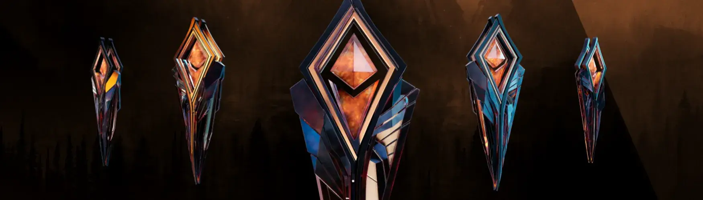

# Human Park - Wayfinders

Wayfinder 是 Human Park 中用途最广泛的神器。 Wayfinders 将在 Human Park 中发挥关键作用，并允许您增强您的游戏体验。 随着 Human Park 生态系统的发展和扩展，Wayfinders 的效用和价值将会增长。

什么是人类公园 -寻路者？
Human Park - Wayfinders是NFT（不可替代令牌）的集合。存储在区块链上的数字艺术品的集合。
▶ 有多少人类公园-寻路者令牌存在？
总共有2，368个Human Park - Wayfinders NFT.目前有1，833个所有者在他们的钱包中至少有一个Human Park - Wayfinders NTF。
▶ 什么是最昂贵的人类公园 - 寻路者销售？
最昂贵的Human Park - Wayfinders NFT出售的是Wayfinder Artifact。它在2022-06-21（2个月前）以$ 109.8的价格出售。
▶ 最近售出了多少辆Human Park - Wayfinders？
在过去的30天内，有43个Human Park - Wayfinders NFT售出。
▶ 人类公园 - 寻路者需要多少钱？
在过去的30天里，最便宜的Human Park - Wayfinders NFT销售额低于38美元，最高销售额超过102美元。人类公园 - Wayfinders NFT的中位数价格在过去30天内为69美元。
▶ 什么是流行的人类公园 - 寻路者替代品？
许多拥有Human Park - Wayfinders NFT的用户还拥有Human Park - Icons，Human Park - Obelisk Artifact，Crypto Goonz和FknApesClub.eth。

