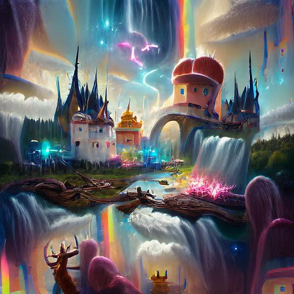

# HumansTown.WTF

CC0 HumansTown.wtf 是 10,000 名优秀的人类士兵的集合，这些士兵被招募来征服地精和精灵军队。 在您最亲爱的国王加里耶斯·维塔利克三世的带领下，我们将战胜并争取派系统治所有这些人。

什么是HumansTown.WTF？
HumansTown.WTF是一个NFT（不可替代令牌）集合。存储在区块链上的数字艺术品的集合。
▶ 有多少 HumansTown.WTF 代币存在？
总共有10，000个HumansTown.WTF NFT.目前有1，124个所有者在他们的钱包中至少有一个HumansTown.WTF NTF。
▶ 最昂贵的HumansTown.WTF销售是什么？
最昂贵的HumansTown.WTF NFT售出的是Human #8390。它于2022-07-03（约2个月前）以3.3美元的价格出售。
▶ 最近卖了多少 HumansTown.WTF？
在过去的30天内，有24个HumansTown.WTF NFT售出。
▶ HumansTown.WTF的成本是多少？
在过去的30天里，最便宜的HumansTown.WTF NFT销售额低于2美元，最高的销售额超过3美元。在过去的30天里，HumansTown.WTF NFT的中位数价格为3美元。
▶ 什么是流行的HumansTown.WTF替代品？
许多拥有HumansTown.WTF NFT的用户还拥有Best Traders Pass，Official Crypto Hearts，peepooptown.wtf和Orktown-wtf。

