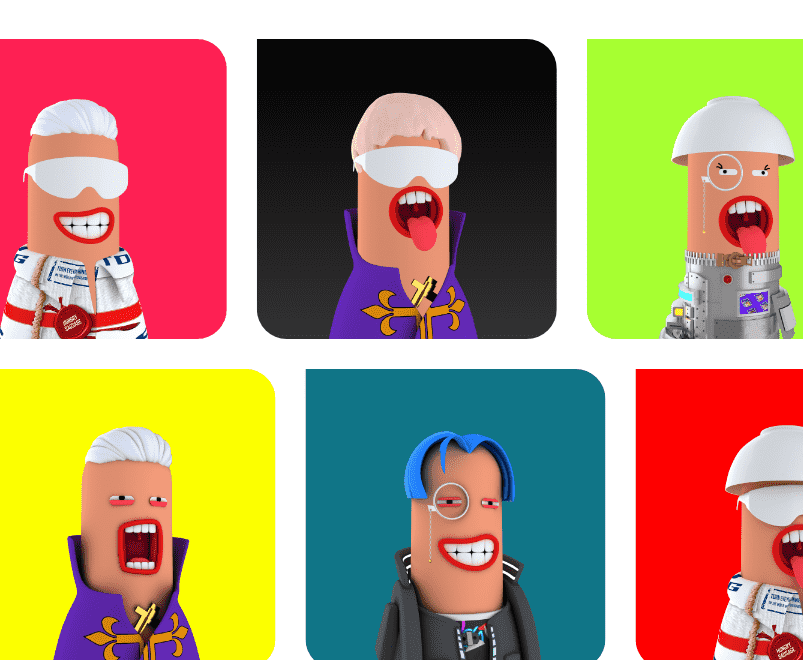

# Hungry Sausage Club

我们在 Instagram 上建立 香肠社区的第一眼，以及
通过迷你游戏和不同的赠品活动与人类进行不和谐的香肠互动为了发现他们存在的真相，香肠们决定在世界各地聚集香肠力量，并为他们在虚拟世界中的“香肠社区”建立自己的银河。在 Hunger 博士的帮助下，他们成功地将自己克隆成 5000 个独特的 Hungry Sausages NFT。

稀有每根香肠都是独一无二的，结合了 3D 基本角色、3D 特征和 2D 特征，这些特征由 9 个类别的 140 多个特征生成，具有不同的牙齿、表情、发型、衣服、配饰等。

