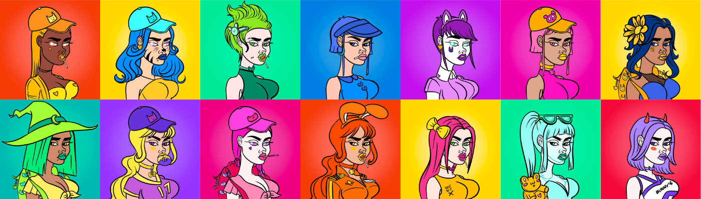

# Hunnys

Hunnys 是生活在以太坊区块链上的 10,000 个可爱纸杯蛋糕的集合！ Hunnys 由 @cryptostacys 创建并于 2021 年 9 月 8 日推出。OG Hunnys 系列于 6 月 15 日创建。 Stacy 的第一个系列 Stacys 于 2021 年 3 月 29 日创建。Hunny 持有者每个月都会收到免费的主题艺术空投，称为 Hunny 的季节。

蜂蜜兔子V2 NFT - 常见问题（FAQ）
▶ 什么是蜂蜜兔子V2？
honey Bunny V2是NFT（不可替代令牌）集合。存储在区块链上的数字艺术品的集合。
▶ 有多少个蜂蜜兔子V2代币存在？
总共有3，490个蜂蜜兔子V2 NFT.目前有913个所有者在他们的钱包里至少有一个蜂蜜兔子V2 NTF。
▶ 兔子V2销售的最昂贵的蜂蜜是什么？
出售的最昂贵的蜂蜜Bunny V2 NFT是HunnyBunny #156。它于2022-07-02（约2个月前）以2.7美元的价格出售。
▶ 最近卖了多少蜂蜜兔子V2？
在过去的30天内，有14个蜂蜜兔子V2 NFT售出。
▶ 蜂蜜兔子V2多少钱？
在过去的30天里，最便宜的蜂蜜Bunny V2 NFT销量低于1美元，最高的销售额超过3美元。在过去的30天里，蜂蜜兔子V2 NFT的平均价格为2美元。
▶ 什么是流行的蜂蜜兔子V2替代品？
许多拥有蜂蜜兔子V2 NFT的用户也拥有We Are All Going To Rise，Invisibears，MoonPussies和MoonNouns。

