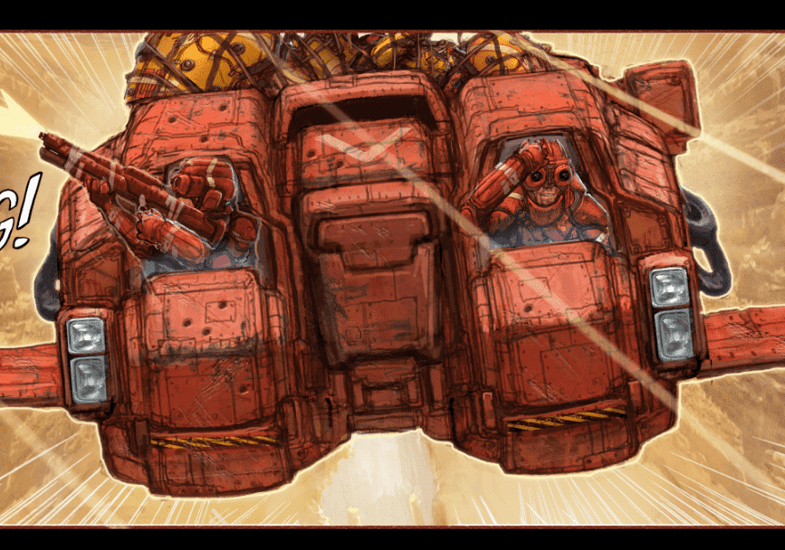

# HUXLEY Comics

[HUXLEY Universe 的基石是Ben Mauro在过去 9 年中开发的六期图画小说系列。

故事讲述了两个浪人战士的旅行，他们偶然发现了一个极其罕见的古老机器人，名为 HUXLEY - 隐藏在 FURY-7 荒原的瓦砾下，这是 Sector-217 的一个荒凉星球。

随着传奇的展开，读者开始解开赫克利的真正目的和起源世界建设者。角色创造者。NFT 艺术家。

作为第一人称射击王朝 Halo 和 Call of Duty 的高级概念设计师和艺术总监，Ben Mauro 的作品对游戏世界产生了巨大影响。Ben 一直在打造角色、武器、机械和游戏场景，使这些特许经营权成为家喻户晓的名字已有 20 年之久。

他的远见为 Elysium、Chappie 和 JRR Tolkien 的《霍比特人》中的大银幕增光添彩，他的想法也传到了太空。Mauro 为 NASA 设计的概念设计穿越了火星贫瘠的红色地形，这一景观有助于激发 Sector-217 的荒地。

最近，Ben 令人印象深刻地进入了 NFT 领域，创造了一系列广获成功的限量版交易卡，名为 Evolution。现在，他揭开了他成熟的图画小说系列的面纱，赫胥黎。一个正在酝酿十年的沉浸式创意世界。

