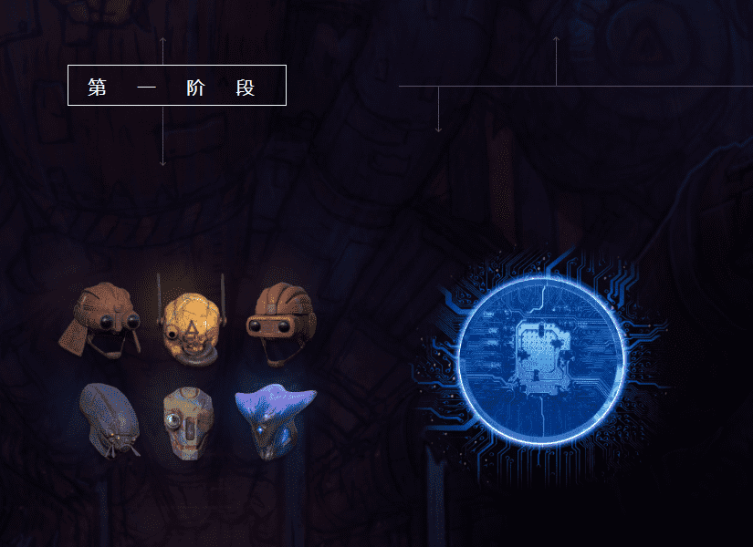

# HUXLEY Genesis

▶ 什么是 HUXLEY Genesis？

HUXLEY Genesis 是一个 NFT（非同质代币）集合。存储在区块链上的数字艺术品集合。

▶ 有多少 HUXLEY Genesis 代币？

总共有 10 个 HUXLEY Genesis NFT。目前，232 位所有者的钱包中至少有一个 HUXLEY Genesis NTF。

▶ 最昂贵的 HUXLEY Genesis 销售是什么？最昂贵的 HUXLEY Genesis NFT 是 [HUXLEY Genesis Token。它于 2022 年 6 月 8 日（3 个月前）以 2.5 万美元的价格售出。

▶ 最近卖出了多少台 HUXLEY Genesis？

过去 30 天内售出了 62 个 HUXLEY Genesis NFT。

▶ HUXLEY Genesis 的价格是多少？

在过去的 30 天里，最便宜的 HUXLEY Genesis NFT 销售额低于 888 美元，最高销售额超过 2150 美元。过去 30 天 HUXLEY Genesis NFT 的中位价格为 1131 美元。

