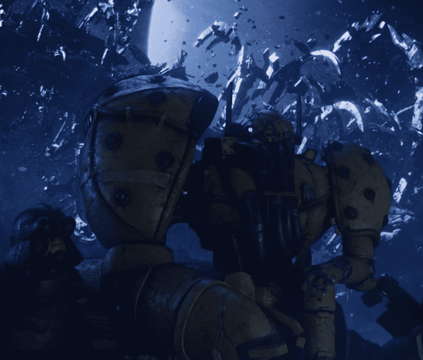

# HUXLEY Humans

HUXLEY Humans 是来自 Fury-7 的 3000 名公民的生成集合，位于 HUXLEY 宇宙的 Sector-217。10 个人类殖民地通过该系列代表不同的视觉风格。

赫胥黎是由著名的科幻概念艺术家 Ben Mauro 制作的 6 期漫画小说宇宙。多期传奇包括漫画的数字和物理版本，以及各种独特的 NFT 收藏品，也可在物理世界中兑换。故事发生在 Fury-7 上，这是一个荒凉的后世界末日星球，被大多数人类遗弃和遗忘。现在，人类、机器人和人工智能必须在一个荒芜的世界中求生，人类的命运岌岌可危。神秘机器人赫胥黎究竟有什么秘密？

