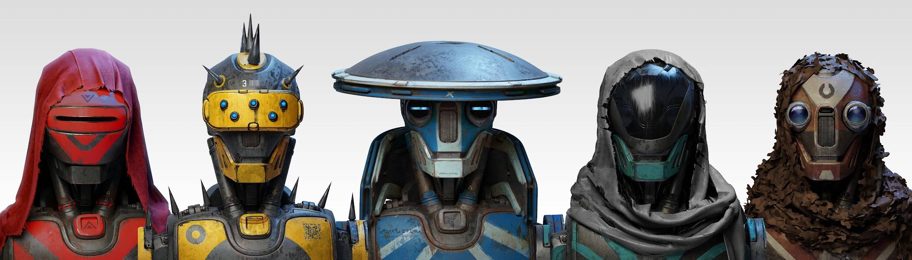

# HUXLEY Robots

HUXLEY 机器人是 Ben Mauro 创建的 1000 个机器人头像的集合。 在 Fury-7 星球上锻造，每个机器人都是手绘的 1:1 艺术品，从 HUXLEY 宇宙穿越星系。 有 10 种机器人类别，每一种都代表不同的一般视觉主题，具有分布在整个系列中的特殊稀有特征。 HUXLEY Avatars 只能用 HUXLEY Genesis Token 铸造探索 HUXLEY 宇宙

什么是赫胥黎机器人？
HUXLEY Robots是NFT（不可替代令牌）的集合。存储在区块链上的数字艺术品的集合。
▶ 有多少赫胥黎机器人代币存在？
总共有1000个赫胥黎机器人NFT.目前有547个所有者在他们的钱包里至少有一个赫胥黎机器人NTF。
▶ 赫胥黎机器人最昂贵的销售是什么？
最昂贵的HUXLEY Robots NFT售出的是HUXLEY Robot #278。它在2022-06-08（3个月前）以$ 8.9k的价格出售。
▶ 最近卖了多少台赫胥黎机器人？
在过去的30天内，有27个HUXLEY Robots NFT售出。
▶ 赫胥黎机器人多少钱？
在过去的30天里，最便宜的HUXLEY Robots NFT销售额低于3260美元，最高销售额超过7000美元。HUXLEY Robots NFT的中位数价格在过去30天内为3842美元。
▶ 什么是流行的赫胥黎机器人替代品？
许多拥有HUXLEY Robots NFT的用户也拥有HUXLEY Genesis，HUXLEY Comics，HUXLEY Comics：ISSUE 4和PUNKS 2：TROPO Collector's Edition。

