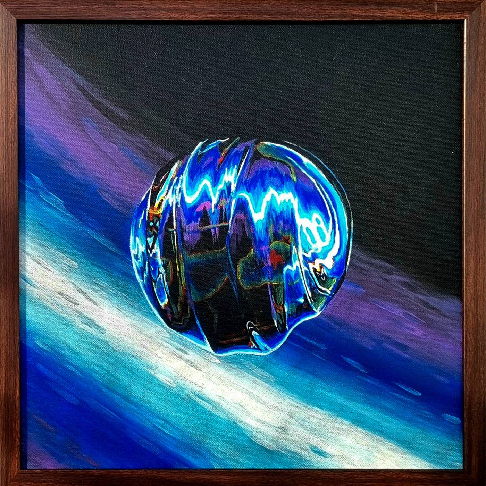

# Hxxk Physicals

Hxxk 实体艺术品的区块链所有权证明

Hxxk 物理 NFT - 常见问题（FAQ）
▶ 什么是Hxxk Physicals？
Hxxk Physicals是一个NFT（不可替代令牌）集合。存储在区块链上的数字艺术品的集合。
▶ 有多少个Hxxk Physicals代币存在？
总共有3个Hxxk Physicals NFT.目前有2个所有者在他们的钱包中至少有一个Hxxk Physicals NTF。
▶ Hxxk Physicals最昂贵的销售是什么？
出售的最昂贵的Hxxk Physicals NFT是Chromosoul 01。它在2022-06-14（2个月前）以1.5k的价格出售。
▶ 最近卖出了多少个Hxxk Physicals？
在过去的30天内，有1个Hxxk Physicals NFT售出。

