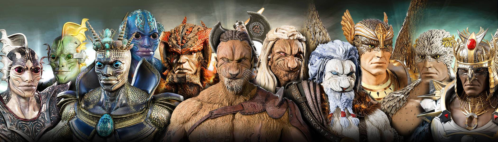

# Hybrid Factions Genesis

Hybrid Factions 是以太坊区块链上 8,626 个独特的 3D 逼真混合体的集合。 由 Netflix 和 Marvel 艺术家设计的 200 多种不同特征和 4 个不同的基本角色。 第一个 Watch2Earn NFT 项目以其独特性脱颖而出。一个值得电影剧本的故事，适应每个派系环境的逼真的 3D 设计和前所未有的路线图。

混合派系 创世纪 NFT - 常见问题（FAQ）
▶ 什么是混合派系创世纪？
Hybrid Factions Genesis是一个NFT（不可替代的令牌）集合。存储在区块链上的数字艺术品的集合。
▶ 有多少个混合派系创世纪代币存在？
总共有275个混合派系创世纪NFT.目前有110个所有者在他们的钱包中至少有一个混合派系创世纪NTF。
▶ 最近卖了多少个混合派系创世纪？
在过去的30天内售出了0个混合派系创世纪NFT。

