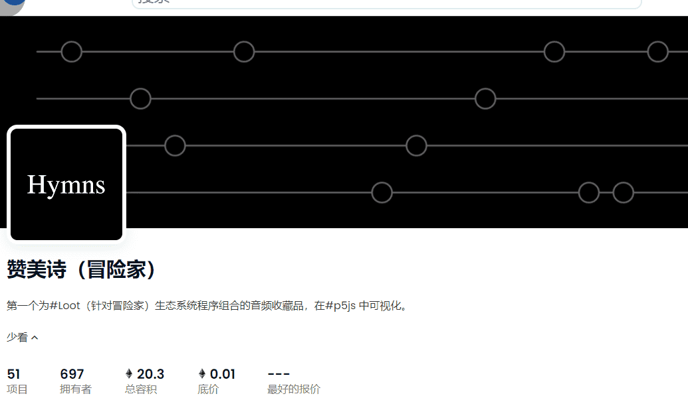

# Hymns (For Adventurers)

▶ 什么是赞美诗（冒险家）？
Hymns (For Adventurers) 是一个 NFT (Non-fungible token) 集合。存储在区块链上的数字艺术品集合。
▶ 有多少 Hymns (For Adventurers) 代币？
总共有 51 个 Hymns (For Adventurers) NFT。目前，697 位所有者的钱包中至少有一本 Hymns (For Adventurers) NTF。
▶ 最近卖了多少赞美诗（冒险者用）？
过去 30 天内售出 0 个 Hymns (For Adventurers) NFT。

