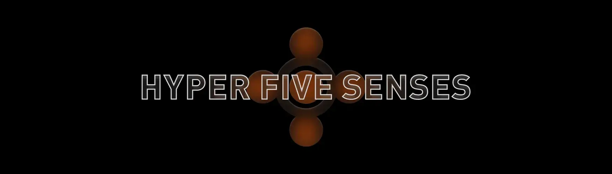

# HyperSenseHumans-HFS

我们的 HSH Hyperverse 需要拥有所有感官的公民！ 集齐所有五种感官，解锁第六种感官，成为真正的超感人。 这是 HyperSenseHumans NFT 项目的 SENSE 合集。 加入我们的 DISCORD 以了解更多信息。

HyperSenseHumans-HFS NFT - 常见问题解答（FAQ）
▶ 什么是HyperSenseHumans-HFS？
HyperSenseHumans-HFS是一个NFT（不可替代令牌）集合。存储在区块链上的数字艺术品的集合。
▶ 有多少个HyperSenseHumans-HFS代币存在？
总共有269个HyperSenseHumans-HFS NFT.目前有95个所有者在他们的钱包中至少有一个HyperSenseHumans-HFS NTF。
▶ HyperSenseHumans-HFS销售中最昂贵的是什么？
出售的最昂贵的HyperSenseHumans-HFS NFT是HyperSense-Auditory。它在2022-06-12（3个月前）以$ 152.7的价格出售。
▶ 最近卖了多少台HyperSenseHumans-HFS？
在过去的30天内，有11个HyperSenseHumans-HFS NFT被售出。
▶ HyperSenseHumans-HFS的成本是多少？
在过去的30天里，最便宜的HyperSenseHumans-HFS NFT销售额低于56美元，最高销售额超过153美元。HyperSenseHumans-HFS NFT在过去30天内的中位数价格为119美元。
▶ 什么是流行的HyperSenseHumans-HFS替代品？
许多拥有HyperSenseHumans-HFS NFT的用户还拥有ANIMALS Meta Club（AMCLUB），AstroGator VX，Fantasy Cat Club和Yury Coding Art的Chaotic Circles。

