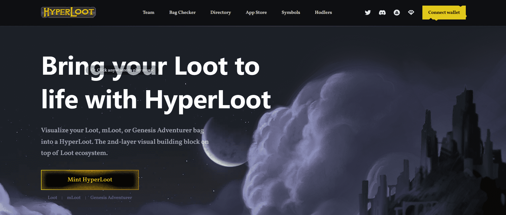

# HyperLoot

Loot 是一个链上 NFT，是 Dom Hofmann 的一个项目，它由 8 个随机冒险者装备物品列表组成，作为黑色背景上的白色文本。Loot 允许社区在 Loot 之上构建他们想要的任何东西。

HyperLoot 将 Loot 包内的所有冒险家装备物品可视化为 HyperLoot 角色上的实际物品。我们将基于文本的 Loot 项目转变为可供使用的实际游戏就绪和元节就绪 HyperLoot 角色。

从长远来看，如果我们将 Loot 称为允许任何人在其上构建的乐高积木，那么 HyperLoot 就是 Loot 之上的第 2 层乐高积木。战利品提供了物品的基础。HyperLoot 提供了使用这些物品的艺术和角色。

HyperLoot 在 Loot 的概念上加倍下注，以 CC0（公共领域）的形式推出，并将开源，以最大限度地提高社区和公司在 HyperLoot 之上构建的创造力自由。

