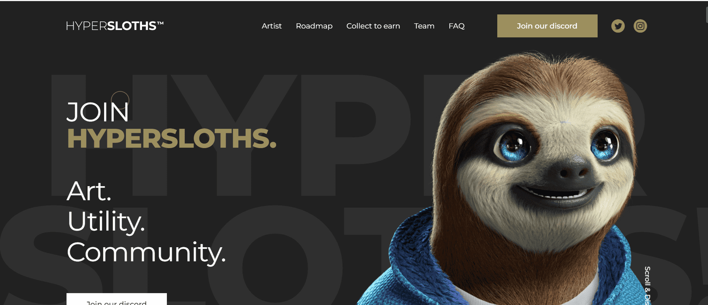

# HYPERSLOTHS-RDY-LABS

HYPERSLOTHS 是 8000 件独特的 3D 艺术作品的集合，活跃在以太坊区块链上。

HYPERSLOTHS 都是关于控制自己的生活，而不是在乎别人的想法。

在某种程度上，它们代表了我们所有人都渴望成为的东西——成功和快乐，但要符合我们自己的定义和标准。

成为 HYPERSLOTH 意味着始终朝着自己的目标前进，但知道何时休息并获得乐趣。

你是超级懒惰的人吗？

