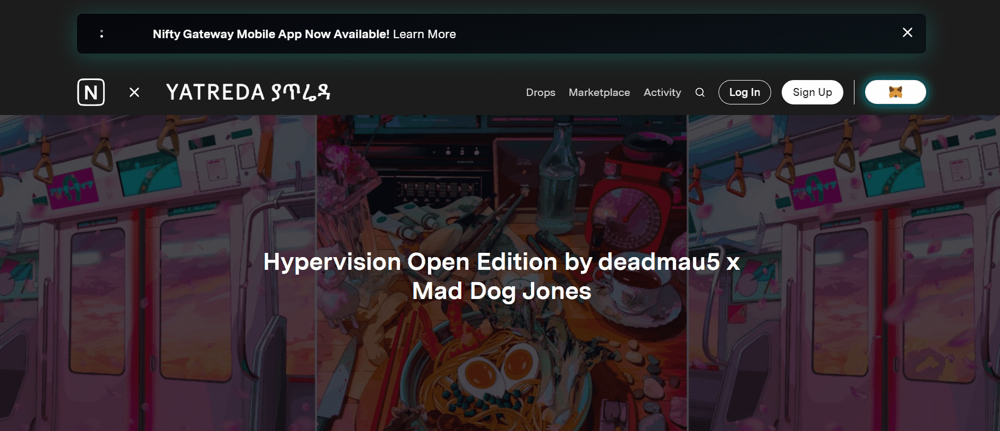

# Hypervision by Deadmau5 x Mad Dog Jones

deadmau5 是加拿大电子音乐制作人、DJ 和音乐家。deadmau5 主要制作前卫的浩室音乐，但他也制作和 DJ 其他类型的电子音乐，包括别名 Testpilot 的 techno。deadmau5 因其作品获得了六项格莱美奖提名。Michah Dowbak aka Mad Dog Jones 是来自安大略省桑德贝的多学科艺术家。他的作品巧妙地将赛博朋克元素与自然的美丽和自由交织在一起。作为他成长的地方一直存在的荒野爱好者，他为都市美学带来了新鲜的主题，以柑橘和霓虹灯的技术色调完成，以某种方式呈现为自然人性的空间。在过去的两年里，他为 Run The Jewels、Deadmau5、Jabbawockeez、Conor McGregor、Maroon 5 和 Chromeo 创作了艺术品。

