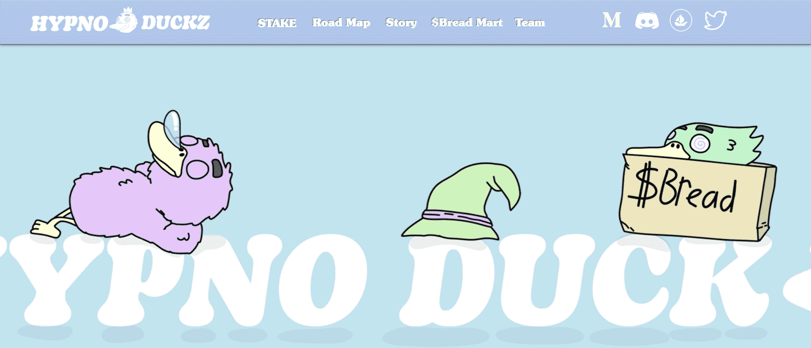

# HypnoDuckz NFTs

▶ 什么是 HypnoDuckz Genesis？
HypnoDuckz Genesis 是一个 NFT（不可替代令牌）集合。存储在区块链上的数字艺术品集合。
▶ 有多少 HypnoDuckz Genesis 代币？
总共有 555 个 HypnoDuckz Genesis NFT。目前，126 位所有者的钱包中至少有一个 HypnoDuckz Genesis NTF。
▶ 什么是最昂贵的 HypnoDuckz Genesis 销售？
最昂贵的 HypnoDuckz Genesis NFT 是 Homie In A Box。它于 2022 年 6 月 28 日（2 个月前）以 713.6 美元的价格售出。
▶ 最近卖出了多少台 HypnoDuckz Genesis？
过去 30 天内售出了 22 个 HypnoDuckz Genesis NFT。
▶ HypnoDuckz Genesis 的价格是多少？
在过去 30 天里，最便宜的 HypnoDuckz Genesis NFT 销售额低于 139 美元，最高销售额超过 381 美元。在过去 30 天内，HypnoDuckz Genesis NFT 的中位价格为 246 美元。
▶ 什么是流行的 HypnoDuckz Genesis 替代品？
许多拥有 HypnoDuckz Genesis NFT 的用户还拥有 The CitaDAO Project、 Ponzi Rugs-Onchain、 Cool Pigz和 Turtle Shell Island。

