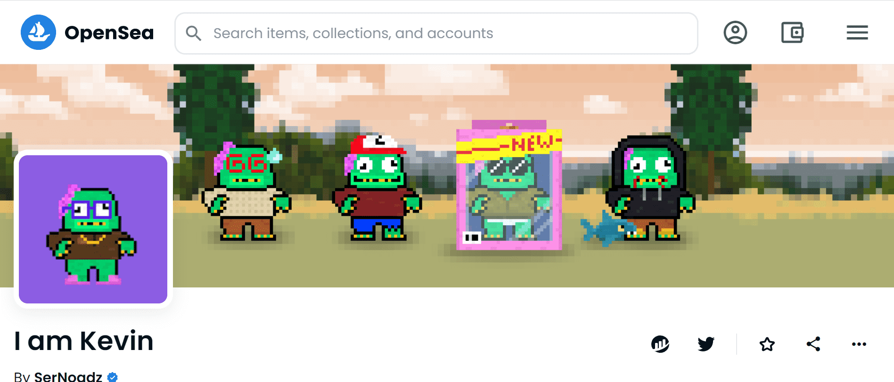

# I am Kevin

▶ 什么是我是凯文？
我是 Kevin 是一个 NFT（非同质代币）集合。存储在区块链上的数字艺术品集合。
▶ 我有多少 Kevin 代币存在？
总共有 2,222 个我是 Kevin NFT。目前，629 位业主的钱包中至少有一个 I am Kevin NTF。
▶ 我是 Kevin 销售中最贵的是什么？
我是 Kevin NFT 卖的最贵的是 我是 Kevin #1083。它于 2022-06-11（3 个月前）以 16.8 美元的价格售出。
▶ 我是凯文最近卖出了多少？
过去 30 天内售出了 3 个 I am Kevin NFT。
▶ 我是凯文的流行替代品有哪些？
许多拥有 I am Kevin NFTs 的用户还拥有 Sidenoun、 The Boney Batz、 EL NUMEROS和 DegenOkayBears。

