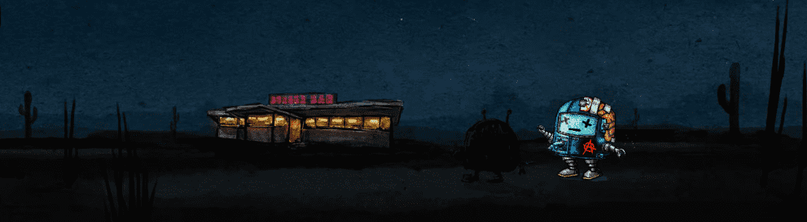

# IAM ROBOT GAME

一些破碎的外星机器人被倾倒在地球上，在荒地中游荡，试图在这个愚蠢的世界上寻找目标。
机器人的最终命运掌握在 NFT 所有者手中。 将向所有人提供太空任务 (GAME)，只有最勇敢的人才能前进并获得 $ROBOT。 关注推特了解游戏进度。

IAM 机器人游戏 NFT - 常见问题（FAQ）
▶ 什么是IAM 机器人游戏？
IAM ROBOT GAME 是一个 NFT（Non-fungible token）集合。存储在区块链上的数字艺术品集合。
▶ 存在多少 IAM ROBOT GAME 代币？
总共有 11 个 IAM ROBOT GAME NFT。目前 9 位所有者的钱包中至少有一个IAM ROBOT GAME NTF。
▶ 最昂贵的IAM ROBOT GAME 销售是什么？
最昂贵的 IAM ROBOT GAME 是 生日机器人。它于 2022 年 6 月 12 日（3 个月前）以 131.7 美元的价格售出。
▶ 最近卖出了多少IAM 机器人游戏？
过去 30 天内售出了 5 个 IAM ROBOT GAME NFT。

