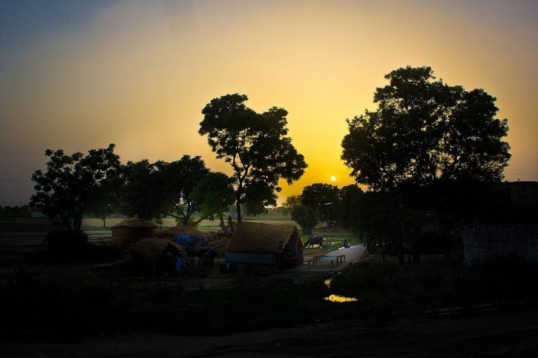

# IBT NFT Gujarat Biogas Project

对这些 NFT 有任何疑问吗？ 请查看我们的支持页面。项目活动的目的是建立 27 个独立的沼气厂（沼气池），每个容量分别为 3m3、4m3、6m3、15m3、60m3 和 85m3，用于服务平均每户 4 人的家庭 使用从印度古吉拉特邦苏拉特、塔皮、纳尔马达、阿南德、纳夫萨里、阿姆雷利和马赫萨纳地区的水牛、奶牛和小牛身上收集的牛粪。每个家庭都直接连接到沼气池并喂牛 粪便进入厌氧消化池。 该技术在印度进行了测试，并已使用多年。 通过在受控的厌氧消化和燃烧系统中利用牛粪，沼气将可用于烹饪能源和热水洗澡。 沼液用作生物肥料。

IBT NFT 古吉拉特邦沼气项目 NFT - 常见问题（FAQ）
▶ 什么是 IBT NFT 古吉拉特沼气项目？
IBT NFT Gujarat Biogas Project 是一个 NFT（非同质代币）集合。存储在区块链上的数字艺术品集合。
▶ 存在多少 IBT NFT Gujarat Biogas Project 代币？
总共有 20 个 IBT NFT Gujarat 沼气项目 NFT。目前 6 位业主的钱包中至少有一个 IBT NFT Gujarat Biogas Project NTF。
▶ 最近卖出了多少IBT NFT古吉拉特沼气项目？
在过去 30 天内售出 0 个 IBT NFT Gujarat Biogas Project NFT。

