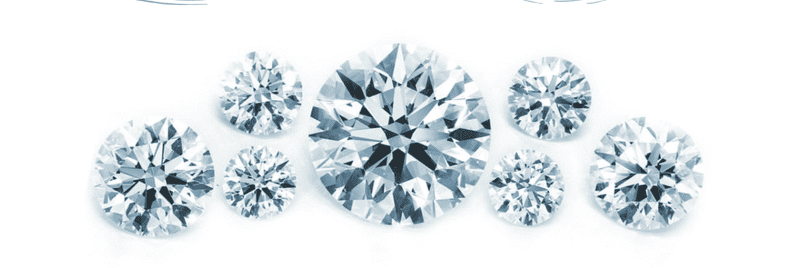

# Icecap Diamonds

Icecap, LLC 出售不可替代的代币，每个代币代表对特定钻石的索赔，存储在纽约市第五大道 580 号的保险库中。 基于 ERC721 的代币可以被购买、出售或赎回（交换为实际的钻石。）

硬资产投资者的钻石市场

作为硬资产投资者，您寻求抵御通货膨胀的保护。
你拥有黄金，你可能拥有白银。但是您可能已经避免使用钻石，因为：

当您准备出售时，零售加价意味着巨大的损失。（高买卖差价）

从来没有一个卖的好地方。当铺永远不应该是您唯一的选择。

对于像钻石这样的不可替代资产，随着时间的推移跟踪价值是很困难的。Icecap 通过基于区块链的市场解决了这些历史问题，使钻石交易与黄金交易相媲美

