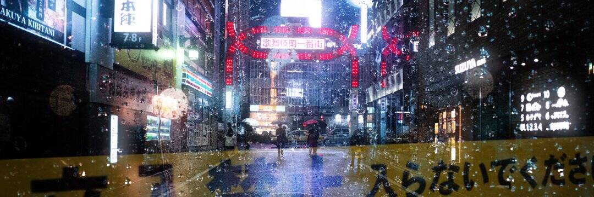

# Ichi-go Ichi-e | Ilan Derech editions

一期一会翻译为“一次，一次会议”； 但在日本禅宗中，它被解释为“只为此时”。这是指珍惜瞬间的不可重复性的做法。 通过实现这种做法，这一刻将留在我们的记忆中，因为未来和过去都无法改变它。我使用反射来创建一个并置，将两个世界融合在一起，重新构建整个场景。 玻璃两侧的灯光形成了一个网格，将主题框定在一个她似乎被其他人包围的世界中； 但由于她和其余元素之间色温的强烈对比，有一种明确分离的暗示，暗示着一次内省之旅。作者：Ilan Derech 收藏：梦想东京 拍摄：徕卡 SL 和蔡司 ZM 1.4/35 地点：东京 , 日本 年份：2021 https://www.ilanderech.com

