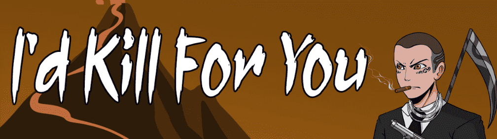

# I'd Kill For You

在过去 7 天内，我会为你杀了 2 次 NFT。《为你杀了》的总销售额为 5.71 美元。I'd For You NFT 的平均价格为 2.9 美元。有 1,019 位 I'd Kill For You 所有者，总共拥有 2,222 个代币。

我们是叛逆的，我们不遵守规则，我们是我会为你杀的。

我会为你杀了 NFT - 常见问题（FAQ）
▶ 什么是我会为你杀的？
I'd Kill For You 是一个 NFT（非同质代币）集合。存储在区块链上的数字艺术品集合。
▶ 我会为你杀了多少代币？
总共有 2,222 个我会为你杀死的 NFT。目前，1,019 位车主的钱包中至少有一个 Id Kill For You NTF。
▶ 我愿意为你而杀的最贵的商品是什么？
我会为你杀的最贵的 NFT 是 我会为你杀#1608。它于 2022-06-23（2 个月前）以 16.5 美元的价格售出。
▶ 最近卖了多少我会杀了你？
在过去的 30 天内，我会为你杀死 157 个 NFT。
▶ 我会为你杀了多少钱？
在过去的 30 天里，最便宜的 I'd For You NFT 销售额低于 4 美元，最高销售额超过 8 美元。在过去 30 天内，我会为你杀死 NFT 的中位价格为 5 美元。
▶ 有哪些流行的“我会为你杀”替代品？
许多拥有 Id Kill For You NFT 的用户还拥有 NEO TOKYO APES、 DragoniaNFT、 Terra Firma。和 德根熊。

