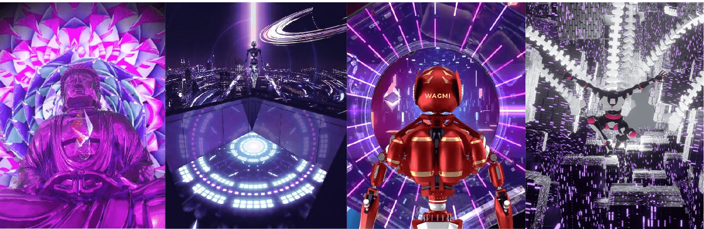

# IDEARTIST

Ideaartist 喜欢用他的动画探索不同的想法，他也喜欢紫色💜这个系列中的艺术品有四个不同的版本 1/5/11/15，每个版本都有不同的属性来设置稀有度。参与 Ideaartist 的旅程 无论您喜欢哪个版本。 此集合由ideartist.eth Etherscan 合约链接托管在ERC-1155 合约上：https://etherscan.io/address/0xdb76ea8d8e976a5dbdefb6fd5230a9d06e864ee2Discord 的更多详细信息：https://discord.com/invite/3vCNdnFjaQ

IDEARTIST NFT - 常见问题（FAQ）
▶ 什么是理想主义者？
IDEARTIST 是一个 NFT（不可替代令牌）集合。存储在区块链上的数字艺术品集合。
▶ IDEARTIST 代币有多少？
总共有 3 个 IDEARTIST NFT。目前，21 位所有者的钱包中至少有一个 IDEARTIST NTF。
▶ IDEARTIST 最昂贵的销售是什么？
最昂贵的 IDEARTIST NFT 是 Cosmic Orgasm。它于 2022-06-10（3 个月前）以 86.2 美元的价格售出。
▶ 最近卖出了多少IDEARTIST？
过去 30 天内售出了 10 个 IDEARTIST NFT。
▶ 什么是流行的 IDEARTIST 替代品？
许多拥有 IDEARTIST NFT 的用户还拥有 Toronto Night Lights、 SPB2050 THE EDITION、 The Fall Minimalist和 MetaHuman-2084。

