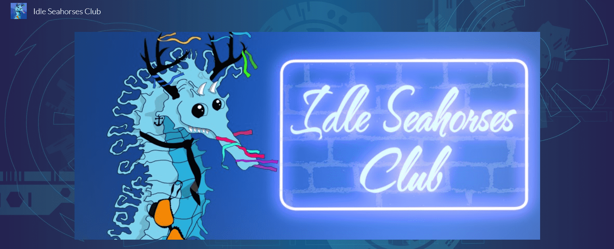

# Idle Seahorses Club

电容

防守
他们不喜欢打架，而是喜欢外面的生活和放松
和平主义者
他们总是尽力提供帮助
虽然他们很少不高兴，但他们可能会发脾气。你不想看到心烦意乱的 Caparace。

卷须

 积极的

他们一直在寻找朋友……和饮料

他们喜欢聚集在酒吧里，给周围的人讲故事。

如果俱乐部内部发生争吵，他们只会拉上饮料的拉链，笑着看着椅子飞过

他们认为自己是优秀的高尔夫球手
天线

积极的

他们总是在做白日梦

他们喜欢聚集在酒吧和俱乐部公园外面

他们往往是理想主义者

他们更喜欢照顾自己的思想而不是他们的身体
尖峰

超级活跃

他们很容易发脾气

他们喜欢聚集在酒吧里，这样他们就可以开始战斗

虽然暴力，但它们可以对其他物种友好......有时

他们定期锻炼

