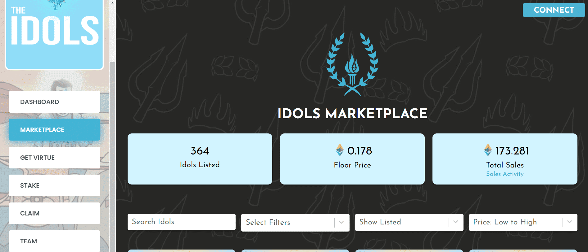

# Idols NFT

▶ 什么是偶像 NFT？
Idols NFT 是一个 NFT（Non-fungible token）集合。存储在区块链上的数字艺术品集合。
▶ Idols NFT 代币有多少？
总共有 9,999 个 Idols NFT NFT。目前，1,492 位所有者的钱包中至少有一个 Idols NFT NTF。
▶ 最昂贵的 Idols NFT 销售是什么？
卖的最贵的 Idols NFT NFT 是 #1033。它于 2022 年 6 月 4 日（3 个月前）以 910.7 美元的价格售出。
▶ 最近卖出了多少 Idols NFT？
过去 30 天内卖出了 101 个 Idols NFT NFT。
▶ Idols NFT 需要多少钱？
在过去 30 天里，最便宜的 Idols NFT NFT 销售额低于 173 美元，最高销售额超过 363 美元。Idols NFT NFT 的中位价格在过去 30 天内为 193 美元。
▶ 流行的 Idols NFT 替代品有哪些？
许多拥有 Idols NFT NFT 的用户还拥有 Bankless Locations、 Kingz Official Council、 The Divine Order Of The Zodiac和 UninterestedUnicornsV2。

