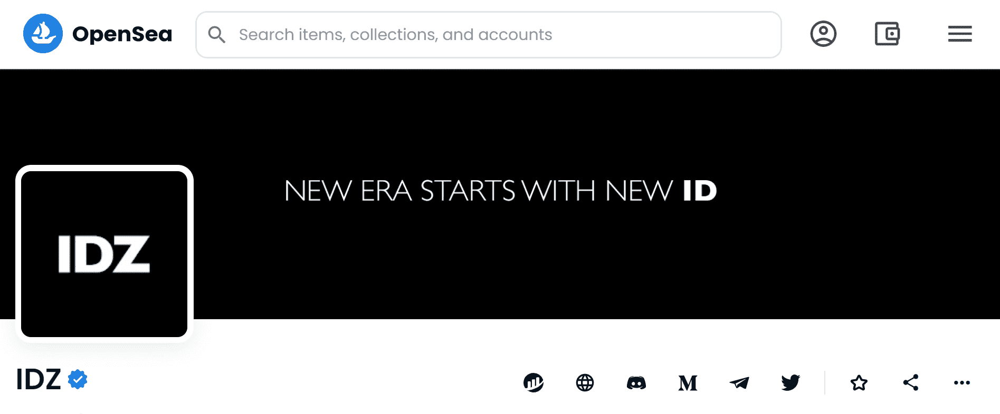

# IDZ

▶ 什么是 IDZ？
IDZ 是一个 NFT（Non-fungible token）集合。存储在区块链上的数字艺术品集合。
▶ 有多少个 IDZ 代币？
总共有 2 个 IDZ NFT。目前 458 位所有者的钱包中至少有一个 IDZ NTF。
▶ 最昂贵的 IDZ 销售是什么？
最昂贵的 IDZ NFT 是 ASSET 0。它于 2022 年 6 月 10 日（3 个月前）以 6.65 万美元的价格售出。
▶ 最近卖了多少IDZ？
过去 30 天内共售出 616 个 IDZ NFT。
▶ IDZ 的费用是多少？
过去 30 天，IDZ NFT 最便宜的销售额低于 11 美元，最高销售额超过 2721 美元。过去 30 天，IDZ NFT 的中位价格为 11 美元。
▶ 流行的 IDZ 替代品有哪些？
许多拥有 IDZ NFT 的用户还拥有 Not For Noobs And Plebs， WeAre by John Johnny， 没什么。和 YOLO 假期。

