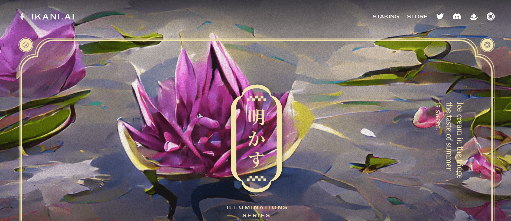

# IKANI.AI

IKANI：ILLUMINATIONS 是 NFT 一系列横幅图像中的第一个，它通过 AI 生成的诗歌和视觉效果来庆祝自然。每个代币都代表一件原创且独特的艺术品，由与 IKANI 合作的个人动态生成。

持有诗歌通行证 NFT 可以访问 IKANI.AI 应用程序，在该应用程序中可以兑换通行证以生成独特的 AI 生成的俳句横幅 NFT。诗歌通行证上的元数据特征被赋予创建的诗歌 NFT，并影响文本和图像生成的输出。

