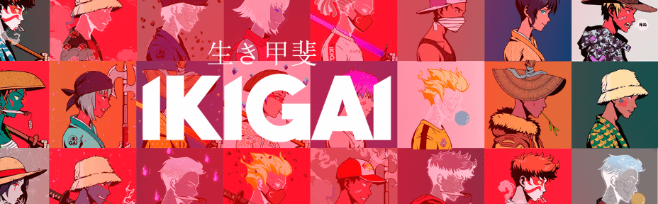

# Ikigai Genesis

使用 260 多种手绘笔画的 7777 种独特算法生成的战士的集合。 Ikigai（生き甲斐，lit. '存在的理由'）是一个日本概念，指的是给人一种目的感，一种生活的理由的东西。

Ikigai Genesis NFT - 常见问题（FAQ）
▶ 什么是Ikigai Genesis？
Ikigai Genesis 是一个 NFT（非同质代币）集合。存储在区块链上的数字艺术品集合。
▶ 有多少 Ikigai Genesis 代币？
总共有 1,982 个 Ikigai Genesis NFT。目前，295 位所有者的钱包中至少有一个 Ikigai Genesis NTF。
▶ 最昂贵的 Ikigai Genesis 销售是什么？
最昂贵的 Ikigai Genesis NFT 是 IKIGAI。它于 2022-07-01（大约 2 个月前）以 76.8 美元的价格售出。
▶ 最近卖出了多少部Ikigai Genesis？
过去 30 天内售出了 33 个 Ikigai Genesis NFT。
▶ Ikigai Genesis 的价格是多少？
在过去 30 天里，最便宜的 Ikigai Genesis NFT 销售额低于 2 美元，最高销售额超过 35 美元。在过去 30 天内，Ikigai Genesis NFT 的中位价格为 7 美元。
▶ 什么是流行的 Ikigai Genesis 替代品？
许多拥有 Ikigai Genesis NFT 的用户还拥有 Minerunners Genesis、KeungzNFT、Sarux Club 和 siimplex。

