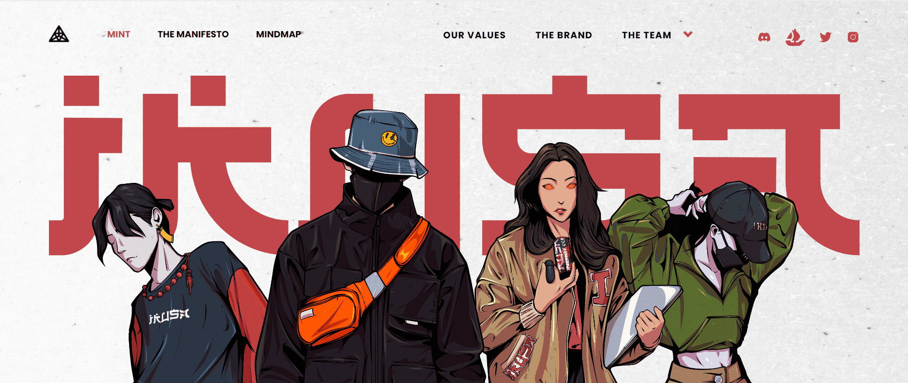

# IKUSA NFT OFFICIAL

Ikusa 是一个 WEB3 街头服饰品牌，灵感来自动漫和高级时尚日本美学。实际的、可衡量的和真实的液体优势是感受真正价值的最佳方式。共享所有权、透明度和隐私、社区以及享受这些好处的好处是 Web3 的核心。

Ikusa 的模型很简单。限量版街头服饰在特定时间以有限的数量提供给不受限制的观众。仅通过 WEB3 网关接受付款，这鼓励了 WEB2 的更多参与，并将访问者吸引到连接 WEB3 和 WEB2 的隧道中。他们的设计永远不会被复制，并且将使用WEB3技术来验证真实性。

