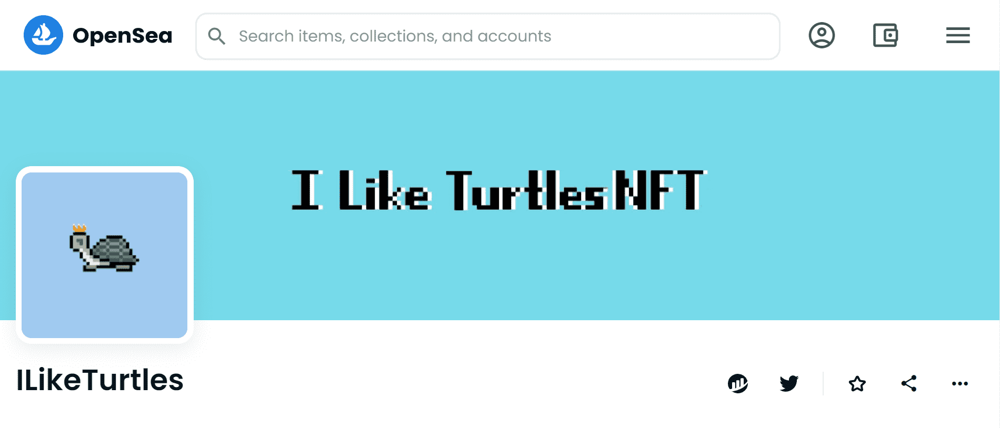

# ILikeTurtles

▶ 什么是 ILikeTurtles？
ILikeTurtles 是一个 NFT（Non-fungible token）集合。存储在区块链上的数字艺术品集合。
▶ 有多少个 ILikeTurtles 代币？
总共有 1,000 个 ILikeTurtles NFT。目前，339 位所有者的钱包中至少有一个 ILikeTurtles NTF。
▶ 最昂贵的 ILikeTurtles 销售是什么？
售出的最昂贵的 ILikeTurtles NFT 是 I Like Turtles #917。它于 2022-08-18（15 天前）以 12.7 美元的价格售出。
▶ 最近卖出了多少ILikeTurtles？
过去 30 天内售出了 2 个 ILikeTurtles NFT。

