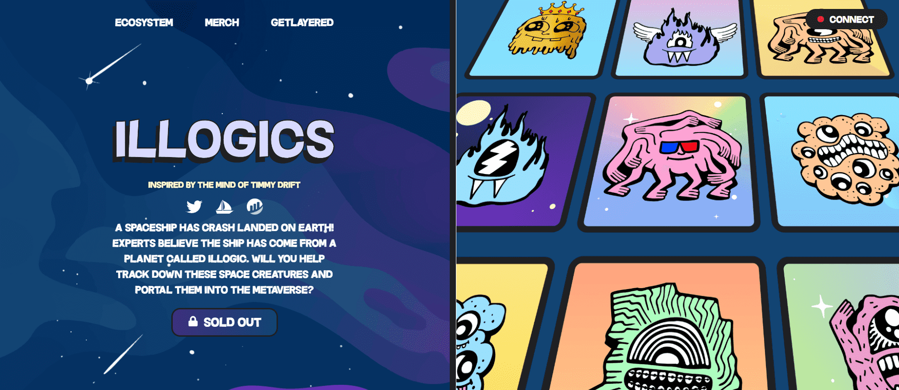

# illogics

illogics 于 4 月 5 日诞生，是一个以社区、实用程序和透明度为中心的 NFT 项目。我们帮助我们的持有者消除 web3 的噪音并结束研磨。

拥有 illogics NFT 的好处包括： 由 illogics 提供支持的市场。• 允许列表（已交付 20,000 多个） • NFT • 服务 • 订阅 • 访问

完全访问数据分析工具，包括： • 稀有排名、交易狙击手、快速购买、趋势选项卡、NFT 日历、NFT 分析、高级收藏图表、批量投标、实时销售、列表、薄荷糖、Discord 机器人高级图表

由于质押，持有人数量无法准确表示。

