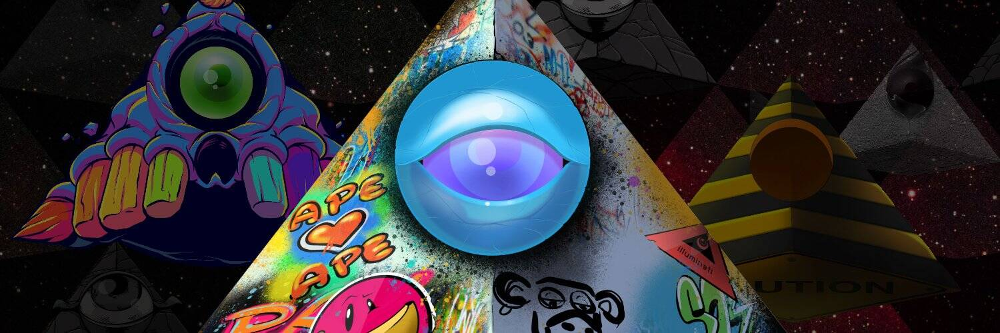

# IlluminatiNFT

IlluminatiNFT 是 8,128 个生成 NFT 的集合。 50% 的二次特许权使用费进入 Illuminati Collective DAO，这是一个社区治理 DAO。每个 IlluminatiNFT 都授予对激活和体验的独家访问权限，并允许您索取 Illuminati DAO 代币。| 网站 | 我们是严厉的先见之明，是不悔改的存在者，他们进入知识的秘密和蛇形巢穴，追求真理的信条我们是知晓的未知者。 我们是那些留下来的人 经过几个世纪的仪式、计算、牺牲和研究，我们向您展示了以下几个： 光明会不可替代代币——区块链上秘密社团的反标如果你想看到真相，如果你想接受 你在圈子里的位置，你必须勇敢地去看

Truth Labs NFT 的 IlluminatiNFT 在过去 7 天内售出 374 次。Truth Labs 的 IlluminatiNFT 总销售额为 317.75 万美元。Truth Labs NFT 的一份 IlluminatiNFT 的平均价格为 849.6 美元。Truth Labs 拥有者共有 3,719 个 IlluminatiNFT，总供应量为 8,128 个。

