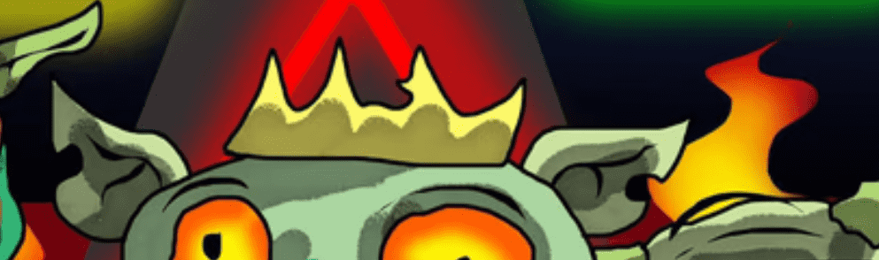

# IlluminatiGoblins

在过去的 7 天里没有出售光明会地精。

IlluminatiGoblins NFT - 常见问题（FAQ）
▶ 什么是光明地精？
IlluminatiGoblins 是一个 NFT（非同质代币）集合。存储在区块链上的数字艺术品集合。
▶ 光明地妖代币有多少？
总共有 5,275 个 IlluminatiGoblins NFT。目前，1,346 位所有者的钱包中至少有一个 IlluminatiGoblins NTF。
▶ 最昂贵的 IlluminatiGoblins 销售是什么？
出售的最昂贵的 IlluminatiGoblins NFT 是 ILLUMINATI GOBLIN #1273。它于 2022-06-20（2 个月前）以 8.8 美元的价格售出。
▶ 最近卖出了多少光明地精？
过去 30 天内售出了 32 个 IlluminatiGoblins NFT。
▶ IlluminatiGoblins 的价格是多少？
在过去 30 天里，最便宜的 IlluminatiGoblins NFT 销售额低于 3 美元，最高销售额超过 5 美元。过去 30 天 IlluminatiGoblins NFT 的中位价格为 4 美元。
▶ 什么是流行的 IlluminatiGoblins 替代品？
许多拥有 IlluminatiGoblins NFT 的用户还拥有 Moonbirdies、 RunningGoblin、 shadowznft.xyz和 Wanna Help but I SUCK。
 交互式 NFT 项目：Goofball Gang。立即购买。

