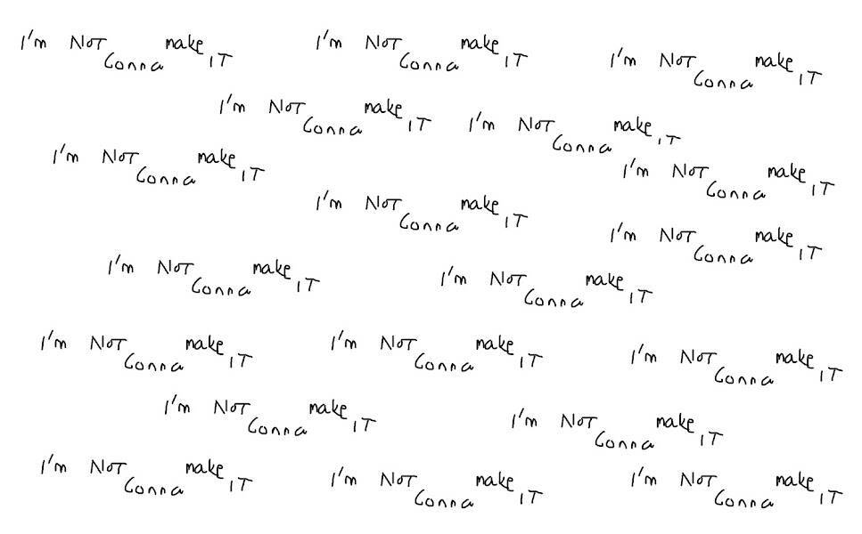

# Im Not Gonna Make It

CC0 - 2222 供应不会制造不和谐😢 不会制定路线图😪 不会制造 -

我不会让它成为 NFT - 常见问题（FAQ）
▶ 什么是“我不会成功”？
Im Not Gonna Make It 是一个 NFT（不可替代代币）集合。存储在区块链上的数字艺术品集合。
▶ 存在多少 Im Not Gonna It 代币？
总共有 2,222 个 Im Not Gonna Make It NFT。目前，1,024 位所有者的钱包中至少有一个 Im Not Gonna Make It NTF。
▶ Im Not Gonna It Sale 最贵的是什么？
出售的最昂贵的 Im Not GONNA Make It NFT 是 I'M NOT GONNA MAKE IT #191。它于 2022-06-07（3 个月前）以 21.8 美元的价格售出。
▶ 最近卖出了多少“我不会成功”？
过去 30 天内售出了 22 个 Im Not Gonna It NFT。
▶ 我不会成功的费用是多少？
在过去 30 天内，最便宜的 Im Not Gonna Make It NFT 销售额低于 5 美元，最高销售额超过 14 美元。在过去 30 天内，Im Not Gonna Make It NFT 的中位价格为 8 美元。
▶ 什么是流行的 Im Not Gonna Make It 替代品？
许多拥有 Im Not Gonna Make It NFT 的用户还拥有 EL NUMEROS、 DegenOkayBears、 WaterBe4nZuki和 Old Legacy。

