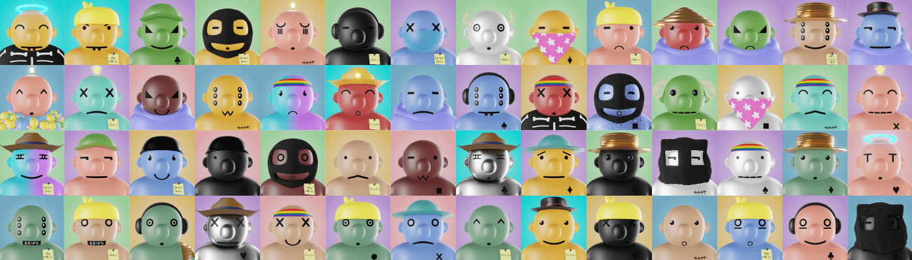

# Imaginary Balls

Imaginary Balls NFT 系列的灵感来自 Imaginary Ones。 令人愉快的 3D 艺术收藏品，初始下降 3333 个独特的 NFT 生活在以太坊区块链上。项目使命是传递创造力、和平、爱和积极性！ 我们希望通过这个项目的影响力，让全球的年轻人才有机会展示他们的艺术！

假想球 NFT - 常见问题（FAQ）
▶ 什么是假想球？
Imaginary Balls 是一个 NFT（不可替代代币）集合。存储在区块链上的数字艺术品集合。
▶ 有多少个 Imaginary Balls 代币？
总共有 3,333 个 Imaginary Balls NFT。目前，946 位所有者的钱包中至少有一个 Imaginary Balls NTF。
▶ 最近卖出了多少假想球？
过去 30 天内售出 0 个 Imaginary Balls NFT。
▶ 什么是流行的 Imaginary Balls 替代品？
许多拥有 Imaginary Balls NFT 的用户还拥有 Okay Space Bears、 Dirty Cardboard、 K. Benjamin Fotos-Project 365和 Not FinanciaI Advice。

