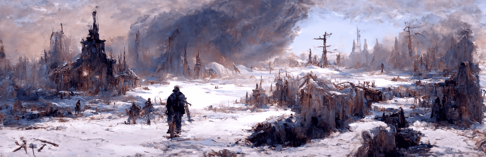

# Imaginary Landscapes Genesis

由 AI 梦寐以求的精选景观集合。 拥有此集合中的 NFT 将授予对所有未来 DownBadDev 掉落以及 [当前已编辑] 的访问权限。

虚构的风景 Genesis NFT - 常见问题（FAQ）
▶ 什么是想象景观创世纪？
Imaginary Landscapes Genesis 是一个 NFT（不可替代代币）集合。存储在区块链上的数字艺术品集合。
▶ 有多少个 Imaginary Landscapes Genesis 代币？
总共有 100 个 Imaginary Landscapes Genesis NFT。目前，78 位所有者的钱包中至少有一个 Imaginary Landscapes Genesis NTF。
▶ 最昂贵的 Imaginary Landscapes Genesis 拍卖会是什么？
最昂贵的 Imaginary Landscapes Genesis NFT 是 Imaginary Landscapes Genesis #37。它于 2022-06-07（3 个月前）以 288.4 美元的价格售出。
▶ 最近卖出了多少《幻境创世纪》？
过去 30 天内售出了 19 个 Imaginary Landscapes Genesis NFT。
▶ Imaginary Landscapes Genesis 需要多少钱？
在过去 30 天里，最便宜的 Imaginary Landscapes Genesis NFT 销售额低于 125 美元，最高销售额超过 288 美元。过去 30 天内，Imaginary Landscapes Genesis NFT 的中位价格为 155 美元。
▶ 有哪些流行的 Imaginary Landscapes Genesis 替代品？
许多拥有 Imaginary Landscapes Genesis NFT 的用户也拥有 Cole Sternberg 的第一场暴雨开始的春天、W A I F U 系列！、Official Youtopia 和 Wall Girls。

