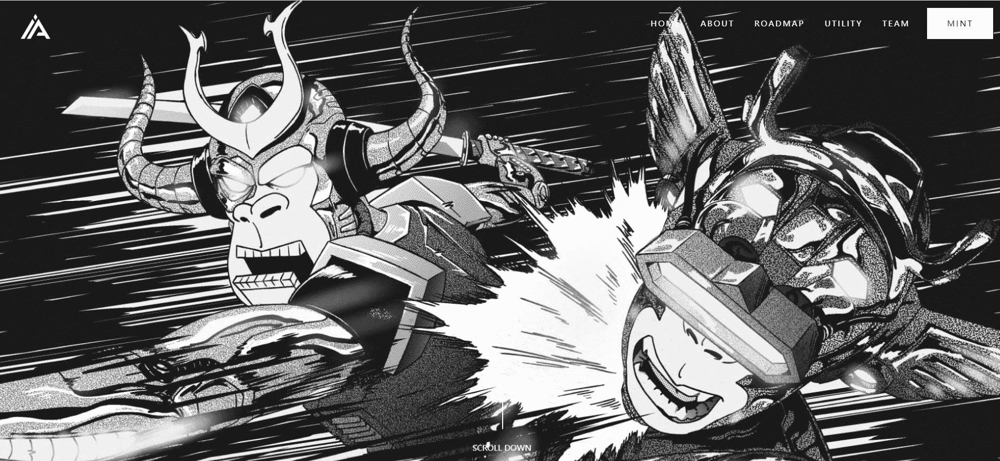

# Immortal Ape - I.A

IMMORTAL APE 是 3,333 种可升级的下一代猿的私人收藏——独特的数字收藏品。猿作为 ERC-721 令牌存储在以太坊区块链上并托管在 IPFS 上。不朽猿社区在 4 天内增长到 100,000 名不和谐成员。

拥有 150 多个手绘特征，每个 NFT 都是独一无二的，并附带专属实用程序的会员资格。加入一个雄心勃勃的、不断发展的社区，并获得多种好处。

每天在每只猿身上赚取 AXP。每只不朽猿每天获得 10 猿经验。您可以使用该 AXP 将您的不朽猿升级到下一个等级。每个等级的供应有限。每次你升级你的猿。旧的被烧了。这意味着供应不会增加！如果你将你的仙猿升级到下一个等级，它在二级市场上会更有价值！我们的升级功能让每个人都有机会拥有一只“有价值的”猿。

我们的收藏中不会有“超稀有”。我们希望给每个持有者一个公平的机会来拥有一只珍贵的猿！

