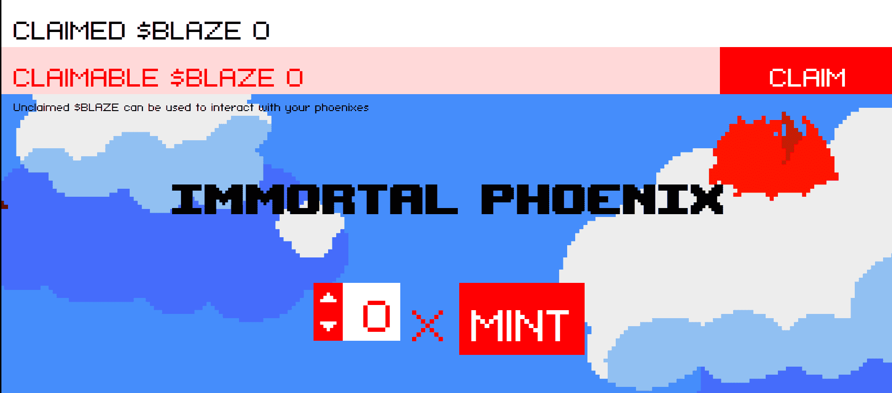

# ImmortalPhoenix

▶ 什么是不朽凤凰？
ImmortalPhoenix 是一个 NFT（Non-fungible token）集合。存储在区块链上的数字艺术品集合。
▶ ImmortalPhoenix 代币有多少？
总共有 999 个 ImmortalPhoenix NFT。目前，454 位所有者的钱包中至少有一个 ImmortalPhoenix NTF。
▶ 最贵的不朽凤凰拍卖会是什么？
最昂贵的 ImmortalPhoenix NFT 是 Phoenix #164。它于 2022 年 6 月 7 日（3 个月前）以 0 美元的价格出售。
▶ 最近卖了多少不朽凤凰？
过去 30 天内售出了 3 个 ImmortalPhoenix NFT。

