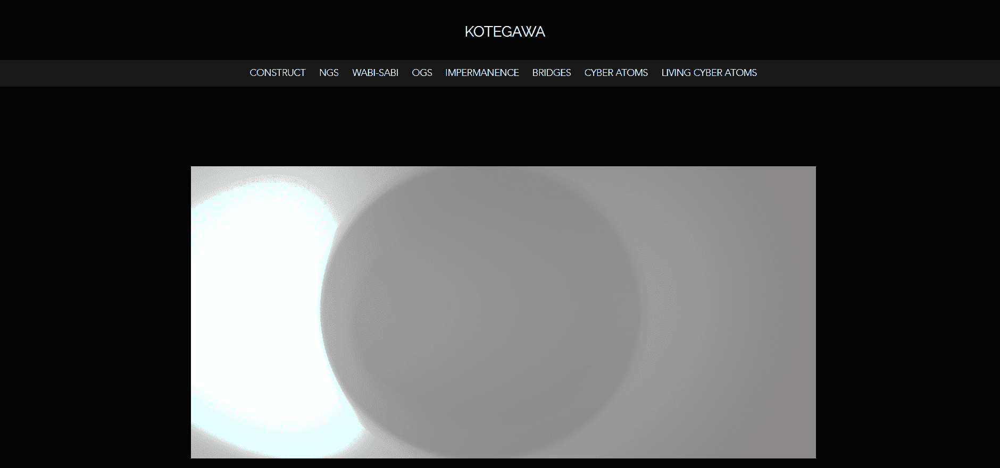

# IMPERMANENCE by KOTEGAWA

一切都是有限的。每一个有机体、物体、时代、经验或记忆。不管是无聊的一天还是世界大战的冲突。一切终将结束。它可能是可怕的、令人羞愧的，或两者兼而有之。我发现将这种无常概念放在“永远”的智能合约上很有趣。

一切基本上都是二进制的，所以我从那个开始。我把这个想法变成了二进制代码，并用它制作了艺术品。然后我将它上传到 IPFS 存储。有趣的是，我没有将它用作实际的 NFT。您只能以图像链接的形式看到它。你看到的 NFT 有一个移动的“粒子”，它是由原始二进制艺术品制成的。

我想展示的是，某件事的重要性或微不足道并不重要。无论大小，没有什么是永恒的。 

如果你正在度过一段美好的时光，那就好好享受吧，因为它总有一天会结束。

如果你正在经历一段糟糕的时光，要坚强，因为它总有一天会结束。

