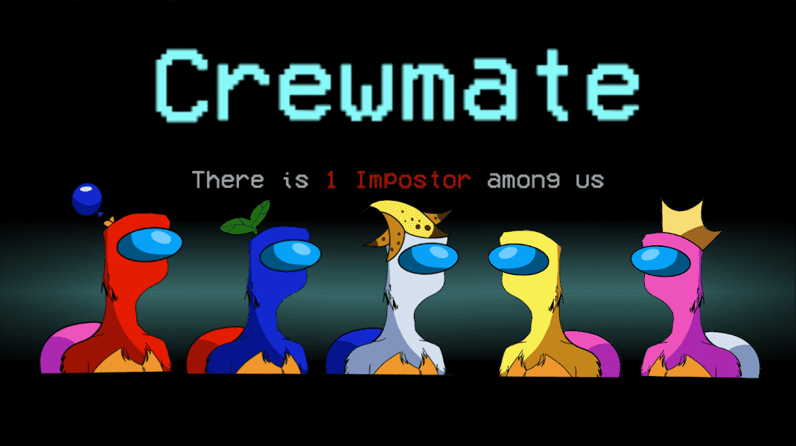

# lmposterApes

2000 年冒名顶替的猿类在区块链上犹豫不决

https://opensea.io/collection/imposter-apes 现在在 OpenSea 上购买走在区块链上的最笨的猿注意你的通风口，保护你的脚，我们无处不在

即将隐形发射

lmposterApes NFT - 常见问题（FAQ）
▶ 什么是 lmposterApes？
lmposterApes 是一个 NFT（非同质代币）集合。存储在区块链上的数字艺术品集合。
▶ 有多少个 lmposterApes 代币？
总共有 2,000 个 lmposterApes NFT。目前，131 位所有者的钱包中至少有一个 lmposterApes NTF。
▶ 最近卖了多少lmposterApes？
过去 30 天内售出 0 个 lmposterApes NFT。

