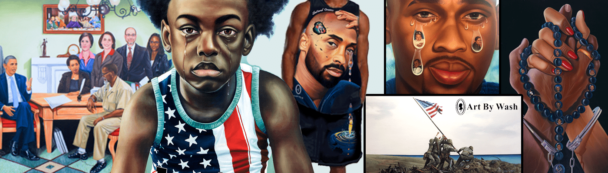

# INCAPTIVITY

INCAPTIVITY 是由 Wash 先生根据他在分娩期间和分娩后创作的美术画设计的 NFT。过去 7 天没有出售 INCAPTIVITY。Art By Wash 的创作主要来自照片、参考资料和艺术家 Fulton Leroy Washington 的独特想象力。这些独特的创作是在布面油画和亚克力上开发的。

要订购独特的创作、绘画或肖像，附上您的照片，并附上您的想法的书面描述以及创作完成后您希望看到或感受的内容，或致电 424-370-8134。

INCAPTIVITY NFT - 常见问题（FAQ）
▶ 什么是失能？
INCAPTIVITY 是一个 NFT（不可替代代币）集合。存储在区块链上的数字艺术品集合。
▶ 存在多少 INCAPTIVITY 代币？
总共有 97 个 INCAPTIVITY NFT。目前 7 位所有者的钱包中至少有一个 INCAPTIVITY NTF。
▶ 最近卖出了多少 INCAPTIVITY？
过去 30 天内售出 0 个 INCAPTIVITY NFT。

