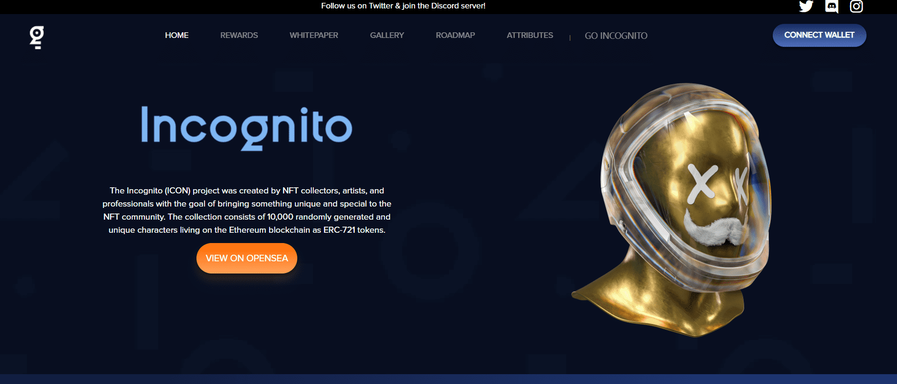

# Incognito

Incognito (ICON) 项目由 NFT 收藏家、艺术家和专业人士创建，旨在为 NFT 社区带来独特而特别的东西。该集合由 10,000 个随机生成的独特角色组成，这些角色作为 ERC-721 令牌生活在以太坊区块链上。

经过三个多月的规划、原型、设计、渲染和头脑风暴，创作了整个 Incognito 系列 NFT 艺术品。我们力求完美，希望创造出视觉上独特且执行良好的东西。

