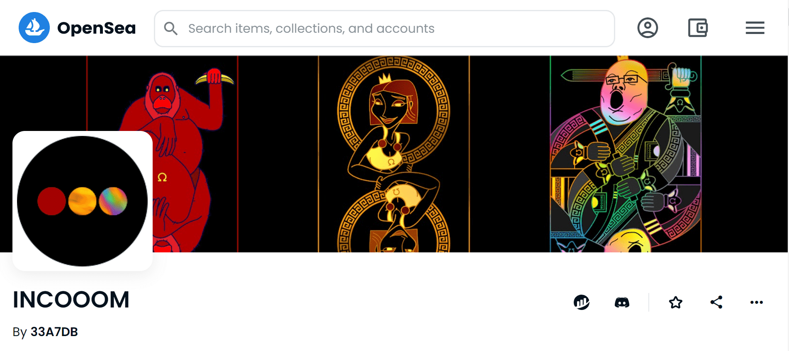

# INCOOOM

什么是INCOOM？

Incooom Finance 是一种革命性的工具，可以促进去中心化金融和 NFT 文化的融合。

INOOOM 是什么时候创建的？

INOOOM 于 2021 年 9 月 14 日首次发行。

有多少 INOOOM 代币？

我们目前正在追踪流通中的 2,916 个尚未销毁或质押的 INCOOOM 代币。

INCOOOM有多少特质？

我们为 INCOOOM 索引了 130 个独特的特征对。

我在哪里可以买到 INCOOOM？

购买 INCOOOM 最常见的地方包括 OpenSea 和 LooksRare 等市场或 Gem.xyz 和 Genie.xyz 等聚合器。链接可以在上面找到！

