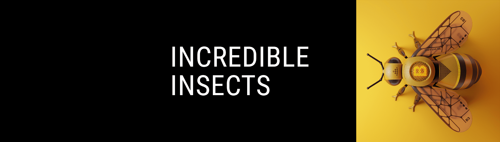

# Incredible Insects

来自不同维度和替代时间线的不可思议的昆虫的集合。 Yuri Mo 用爱打造。

Incredible Insects NFT - 常见问题 (FAQ)
▶ 什么是不可思议的昆虫？
Incredible Insects 是一个 NFT（不可替代代币）集合。存储在区块链上的数字艺术品集合。
▶ 有多少 Incredible Insects 代币？
总共有 9 个 Incredible Insects NFT。目前，19 位所有者的钱包中至少有一个 Incredible Insects NTF。
▶ 最近卖出了多少不可思议的昆虫？
过去 30 天内售出了 0 个 Incredible Insects NFT。
▶ 什么是流行的 Incredible Insects 替代品？
许多拥有 Incredible Insects NFT 的用户还拥有 Cypher's Flowers、 Secret Society Pixel Whales、 STARBOT UNIVERSE和 The Sandbox Mega City 2 Land Sale。

