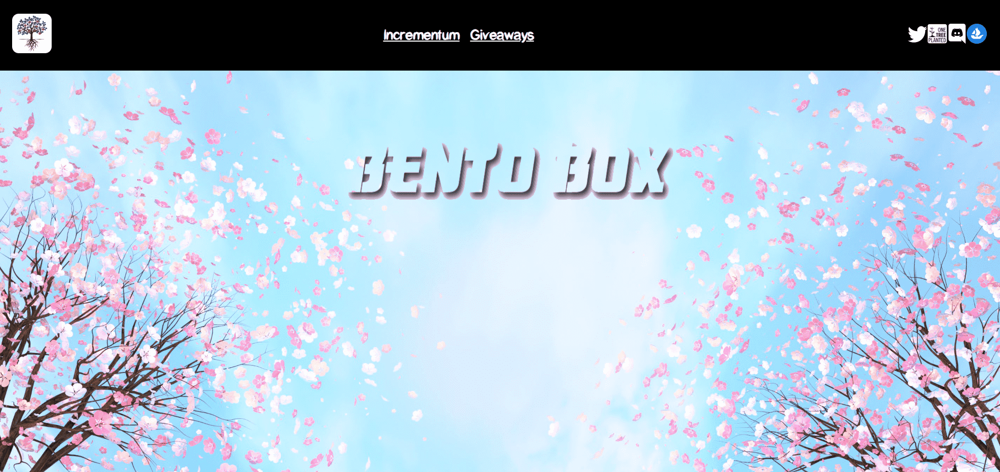

# Incrementum

人们喜欢在这个空间赌博。这就是为什么我们的团队将为我们的便当盒创建游戏化实用程序的原因。我们的团队将为便当盒持有者安排定期赠品。如果您的号码被抽中，那就太好了，您就是赢家！！但是，某些稀有属性可以使您的奖金成倍增加。

示例：我们的赠品为 0.1 ETH，您的号码被抽中。在您的便当盒中拥有一双金色筷子，您的价格是 10 倍，总共 1 ETH！

这使得稀有物品的价值成倍增加。具有稀有属性的盒子不仅在稀有工具上排名更高，而且它们实际上为持有者本身提供了更多价值。

