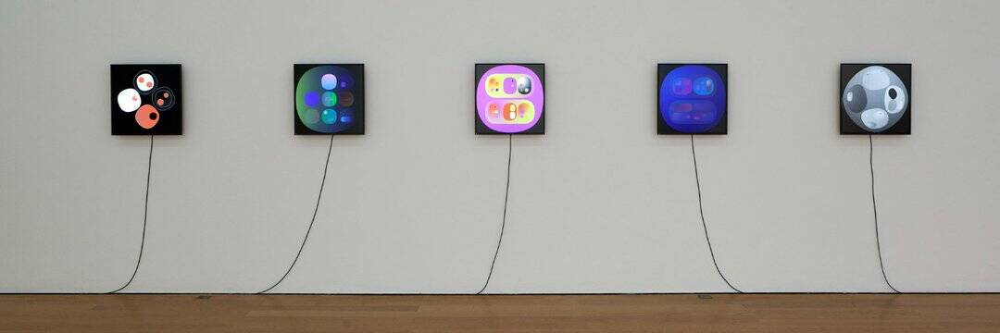

# Indiscreet Units

Indiscreet Units 包含 266 个以上的色调旋转标志，存储在以太坊区块链和 IPFS 上。 由 Chemsex Benelux 委托 Harm van den Dorpel 制作。

Indiscreet Units NFT 在过去 7 天内售出 1 次。Indiscreet Units 的总销售额为 241.52 美元。一个 Indiscreet Units NFT 的平均价格为 241.5 美元。有 156 个 Indiscreet Units 所有者，总共拥有 266 个代币

轻率单位 NFT - 常见问题 (FAQ)
▶ 什么是轻率单位？
Indiscreet Units 是一个 NFT（非同质代币）集合。存储在区块链上的数字艺术品集合。
▶ 存在多少 Indiscreet Units 代币？
总共有 266 个 Indiscreet Units NFT。目前，156 位业主的钱包中至少有一个 Indiscreet Units NTF。
▶ 什么是最昂贵的 Indiscreet Units 销售？
出售的最昂贵的 Indiscreet Units NFT 是 葡萄牙。它于 2022 年 6 月 28 日（2 个月前）以 241.5 美元的价格售出。
▶ 最近卖出了多少 Indiscreet Units？
过去 30 天内售出了 4 个 Indiscreet Units NFT。
▶ 什么是流行的 Indiscreet Units 替代品？
许多拥有 Indiscreet Units NFT 的用户还拥有 FWB.art Miami Basel 2021、 Markov's Dream: Orb (lite)、 NUXUI和 POTEnZA。

