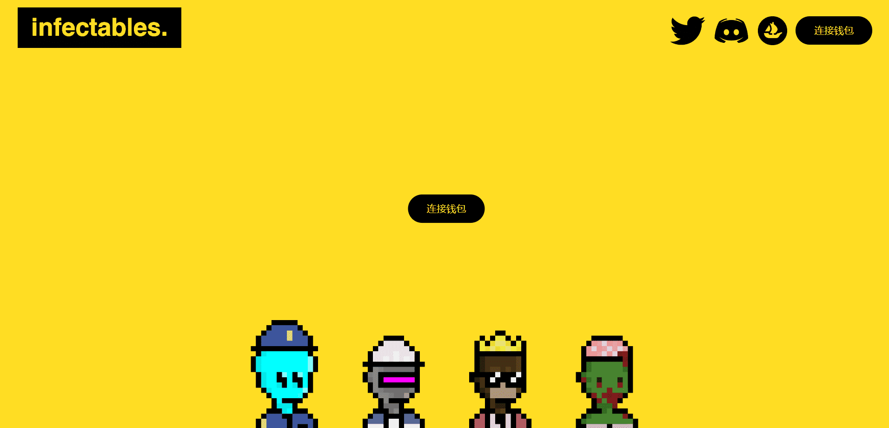

# Infectables

什么是传染病？

雇员被一种神秘的病毒感染。但是每个人都应该工作...

Infectables 是什么时候创建的？

Infectables 于 2022 年 7 月 17 日首次发行。

有多少 Infectables 代币？

我们目前正在追踪流通中的 4,959 个尚未被销毁或质押的 Infectables 代币。

Infectables有多少特征？

我们为 Infectables 索引了 90 个独特的特征对。

我在哪里可以买到传染病？

购买 Infectables 最常见的地方包括 OpenSea 和 LooksRare 等市场或 Gem.xyz 和 Genie.xyz 等聚合器。链接可以在上面找到！

